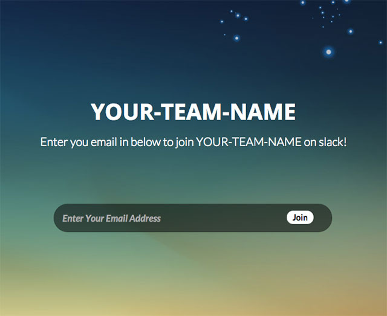
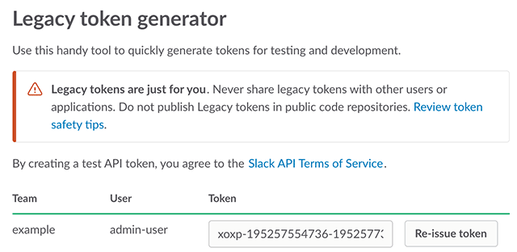
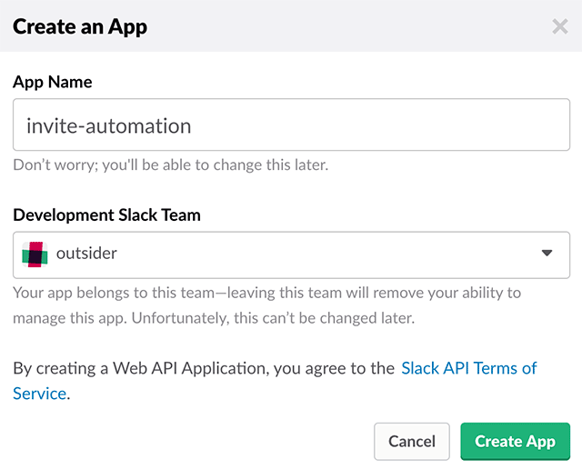
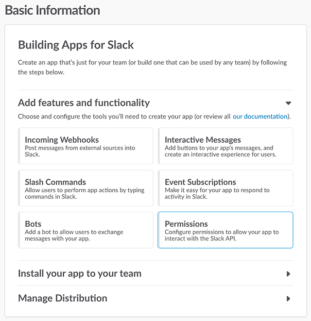
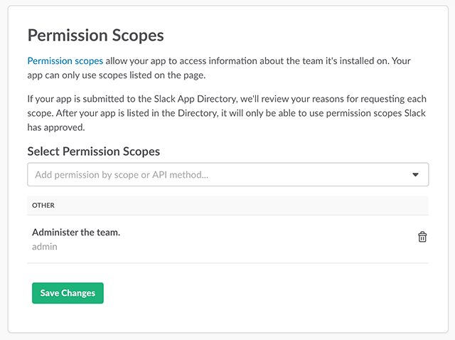
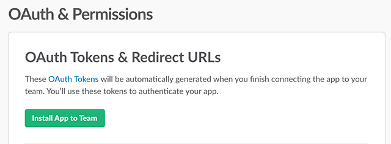
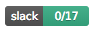
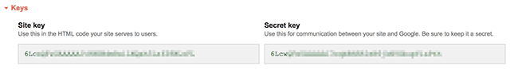

Slack Invite Automation
------------

[](https://travis-ci.com/outsideris/slack-invite-automation)

A tiny web application to invite a user into your Slack team.

Inspired by
[How I hacked Slack into a community platform with Typeform](https://levels.io/slack-typeform-auto-invite-sign-ups/)
and Socket.io's Slack page.

This project supports Heroku, Azure, Cloud Foundry, and Amazon Web Services (AWS).

[](https://heroku.com/deploy)
[](https://azuredeploy.net/)

## Settings

You can set variables for your own purpose in `config.js` or environment variables.

### `config.js`

Fill out `config.js` as your infomation.

* `community`: your community or team name to display on join page.
* `slackUrl` : your slack team url (ex.: socketio.slack.com)
* `slacktoken` : Your access token for Slack. (see [Issue token](#issue-token))
* `inviteToken`: An optional security measure - if it is set, then that token will be required to get invited.
* `recaptchaSiteKey`: An optional security measure - if it is set, and `recaptchaSecretKey` is set, then a captcha will be required to get invited.
* `recaptchaSecretKey`: An optional security measure - if it is set, and `recaptchaSiteKey` is set, then a captcha will be required to get invited.
* `locale`: Application language (currently `cs`, `de`, `en`, `es`, `fr`, `it`,  `ja`, `ko`, `nl`, `pl`, `pt`, `pt-BR`, `tr`, `zh-CN` and `zh-TW` available).
* `subpath`: Sub-path in URL. For example, if `/example` is set, it's served in `/example`, not `/`. Default is `/`.

### Environment Variables
You can set environment variables directly or in `.env` file.
If you want to use a `.env` file, create a file in the root called `.env` with the following key/value pairs.
(`.env` files are added to the `.gitignore`.)

- `COMMUNITY_NAME` : Your community or team name to display on join page.
- `SLACK_URL` : Your Slack team url (ex.: socketio.slack.com)
- `SLACK_TOKEN` : Your access token for Slack. (see [Issue token](#issue-token))
- `INVITE_TOKEN`: An optional security measure - if it is set, then that token will be required to get invited.
- `RECAPTCHA_SITE`: An optional security measure - used to enable reCAPTCHA.
- `RECAPTCHA_SECRET`: An optional security measure - used to enable reCAPTCHA.
- `LOCALE`: Application language (currently `cs`, `de`, `en`, `es`, `fr`, `it`, `ja`, `ko`, `nl`, `pl`, `pt`, `pt-BR`, `tr`, `zh-CN` and `zh-TW` available).
- `SUBPATH`: Sub-path in URL. For example, if `/example` is set, it's served in `/example`, not `/`. Default is `/`.

**Sample**

```
COMMUNITY_NAME=socketio
SLACK_URL=socketio.slack.com
SLACK_TOKEN=ffsdf-5411524512154-16875416847864648976-45641654654654654-444334f43b34566f
INVITE_TOKEN=abcdefg
LOCALE=en
```

You can test your token via curl:

  ```shell
   curl -X POST 'https://YOUR-SLACK-TEAM.slack.com/api/users.admin.invite' \
   --data 'email=EMAIL&token=TOKEN&set_active=true' \
   --compressed
  ```

### Heroku / Azure

Add the application settings that are defined in the environment variables above.

### Amazon Web Services (AWS)

If you have an AWS account and have already installed and configured the AWS CLI tool, you can easily deploy this application to API Gateway and Lambda via CloudFormation in a few minutes.

Instead of editing `config.js`, take these steps:

1. Copy `aws/config.example.sh` to `aws/config.sh`
2. Edit the values in `aws/config.sh`, which correspond to the variables described above, plus these:
    * `StackName`: the name of the CloudFormation stack to create
    * `S3BucketArtifacts`: the name of an existing S3 bucket you have write access to, for storing deployment artifacts
    * `S3PrefixArtifacts`: the prefix to use within that S3 bucket for all deployment artifacts written
3. Run `aws/deploy.sh` to create the CloudFormation stack and deploy your application, outputting the URL
4. (Optional) For a friendlier URL, log into the AWS web console and establish a custom domain pointing to the API Gateway stage deployed in step 3.

## Run
[Node.js](http://nodejs.org/) is required.

```shell
$ git clone https://github.com/outsideris/slack-invite-automation.git
$ cd slack-invite-automation
$ npm install
$ npm start
```

You can access <http://localhost:3000> on your web browser.



## Run with Docker

It's easy to run this service if you have installed Docker on your system.
Pull [the Docker image from Docker Hub](https://hub.docker.com/r/outsideris/slack-invite-automation/).

```shell
$ docker pull outsideris/slack-invite-automation
$ docker run -it --rm -e COMMUNITY_NAME="YOUR-TEAM-NAME" -e SLACK_URL="YOUR-TEAM.slack.com" -e SLACK_TOKEN="YOUR-ACCESS-TOKEN" -p 3000:3000 outsideris/slack-invite-automation
```

Or, You can build a Docker image yourself.

```shell
$ git clone https://github.com/outsideris/slack-invite-automation.git
$ cd slack-invite-automation
$ docker build -t outsideris/slack-invite-automation .
$ docker run -it --rm -e COMMUNITY_NAME="YOUR-TEAM-NAME" -e SLACK_URL="YOUR-TEAM.slack.com" -e SLACK_TOKEN="YOUR-ACCESS-TOKEN" -p 3000:3000 outsideris/slack-invite-automation
```

## Issue token
**You should generate the token in admin user, not owner.** If you generate the token in owner user, a `missing_scope` error may occur.

There are two ways to issue the access token.

### Legacy tokens
1. Visit <https://api.slack.com/custom-integrations/legacy-tokens>.
1. Click `Create token`.

    

### OAuth tokens
1. Visit <https://api.slack.com/apps> and Create New App.

    

1. Click "Permissions".

    

1. In "OAuth & Permissions" page, select `admin` scope under "Permission Scopes" menu and save changes.

    

1. Click "Install App to Team".

    

1. Visit <https://slack.com/oauth/authorize?&client_id=CLIENT_ID&team=TEAM_ID&install_redirect=install-on-team&scope=admin+client> in your browser and authorize it.
    * It authorizes the `client` permission. Otherwise, you can see `{"ok":false,"error":"missing_scope","needed":"client","provided":"admin"}` error.
    * Your `CLIENT_ID` could be found in "Basic Information" menu of your app page that you just install.
    * Your `TEAM_ID` could be found in <https://api.slack.com/methods/team.info/test>

## Badge



You can use the badge to show status of user in your slack.

* With default colors:
    ```
    
    ```

* With custom colors:

    * `?colorA=abcdef` Set background of the left part (hex color only)
    * `?colorB=fedcba` Set background of the right part (hex color only)

    ```
    
    ```

## reCAPTCHA
Register a new site in [Google reCAPTHCA](https://www.google.com/recaptcha/)
as reCAPTCHA v2 type.



Set "Site key" as `recaptchaSiteKey` or `RECAPTCHA_SITE`,
and "Secret key" as `recaptchaSecretKey` or `RECAPTCHA_SECRET`.
